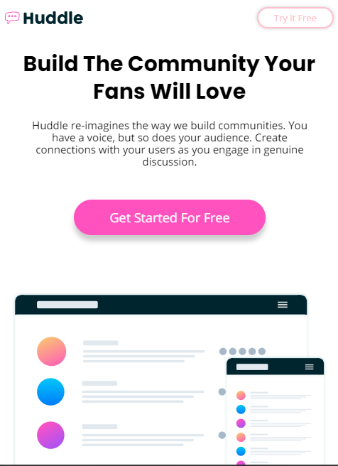

# Frontend Mentor - Huddle landing page with curved sections solution

- Live Site URL: [View the live site here](https://Iamronaldosunmu.github.io/huddle-landing-page-with-curved-sections)


This is a solution to the [Huddle landing page with curved sections challenge on Frontend Mentor](https://www.frontendmentor.io/challenges/huddle-landing-page-with-curved-sections-5ca5ecd01e82137ec91a50f2).

## Table of contents

- [Frontend Mentor - Huddle landing page with curved sections solution](#frontend-mentor---huddle-landing-page-with-curved-sections-solution)
  - [Table of contents](#table-of-contents)
  - [Overview](#overview)
    - [The challenge](#the-challenge)
    - [Screenshot](#screenshot)
    - [Links](#links)
  - [My process](#my-process)
    - [Built with](#built-with)
    - [What I learned](#what-i-learned)
    - [Continued development](#continued-development)
    - [Useful resources](#useful-resources)
  - [Author](#author)


## Overview

### The challenge

Users should be able to:

- View the optimal layout for the site depending on their device's screen size
- See hover states for all interactive elements on the page

### Screenshot




### Links

- Live Site URL: [View the live site here](https://Iamronaldosunmu.github.io/huddle-landing-page-with-curved-sections)

## My process
I used the bottoms up approach to build the individual components and later assembled them to form the whole site.
### Built with

- Semantic HTML5 markup
- CSS custom properties
- Flexbox
- CSS Grid
- Mobile-first workflow
- Animate on scroll Library

### What I learned

This project gave me confidence to keep building more projects. I worked with the javascript animate on scroll library to animate the different components in the page. 

```html
<script src="https://unpkg.com/aos@2.3.1/dist/aos.js"></script>
    <script>
      AOS.init();
    </script>
```
```css
.proud-of-this-css {
  display: flex;
  align-items: center;
  justify-content: center;
  /* Centering a div in css */
}
```


### Continued development

Currently learning UI/UX design and react.js by building projects.
### Useful resources

- [The Ultimate Html and Css Course](https://www.codewithmosh.com) -This course contains everything you need to start building projects with html and css, it will take you from zero to hero.
- 
## Author


- Twitter - [@IamRonald05](https://www.twitter.com/IamRonald05)

